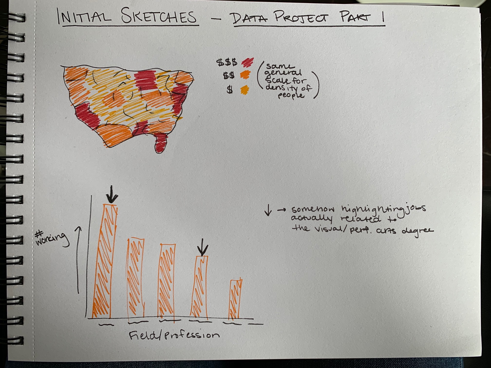

# Data Project Part 1

## Outline

I was really intrigued by the data I used for my second visualization assignment about the professions of those who received visual or performing arts degree. This led me to decide to use datasets on the same sort of data for my final project. As an arts lover and someone who wants to go into the professional arts management field, it was important for me to understand where these artistic people are coming from and what they’re doing now. 
My final project will be a summary of what areas of the country have the highest paid visual and performing arts degree recipients, along with what areas of the country have the highest concentration of visual and performing arts degrees. Then, this will be juxtaposed by the distribution of visual and performing arts degrees recipients across different professional fields.
I am hoping to tell the story of where there visual and performing arts degree recipients are now, where they can be paid the most, and what professions they can expect they may go into. Sadly, the data points to that many of these degree recipients are not in the visual and performing arts fields. My call to action would be for employers to be continually understanding of the clear multiple talents visual and performing arts degree recipients have, while also understanding the pay they deserve.

### User Stories
“As a current student completing a visual or performing arts degrees, I want to know what people with my degrees do, so that I can better prepare for my life post-college.”

“As a recipient of a visual or performing arts degree that is currently working, I want to know more about people like me and if what I’m experiencing is normal, so that I can better understand myself and my cohort.”

“As a potential employer of visual or performing arts degree recipients, I want to better understand these employees, so that I can more effectively hire and work with them.”

## Initial Sketches

## My Selected Data

I selected my data from Data USA when I found a page on their site dedicated to people who have received visual or performing arts degrees and where they are now. The page has a multitude of very specific data sets based on one subject of interest. For this reason, I selected three datasets to create more of a well-rounded project. I selected the 3 main datasets because they were the topics most interesting to me, but I may end up going back and finding another dataset from the same page if I find an interesting gap or missing point in my data analysis and story!

All my data sets will turn into different graphs to outline different aspects of my story. I want to use them all to present a comprehensive but coherent outline of people who received visual and performing arts degrees and their current status. While these are all different spreadsheets, they all follow the same subject, so I think it makes sense to treat them as one dataset, for the most part.

### Link to Data USA Page
https://datausa.io/profile/cip/visual-performing-arts

### Link to Data Samples
[Highest Paying Location Data](HighestPaying_Locations_Sample.xlxs)
[Highest Concentration Location Data](SpecialtyLocation_Data.csv)
[Current Occupation Distribution Data](CurrentOccupations.csv)

## Method & Medium

I plan to use Shorthand as my final deliverable for this project. While it is not a platform I’ve utilized, I feel putting myself in a place to learn how to use even more platforms and resources is the best option for me. 

The structure of my story will center around showcasing the highest paying areas of the country for visual and performing arts degrees recipients, which will then be juxtaposed against the areas of the country with the highest concentrations of visual and performing arts degree recipients. Then, I will present data showing the field and professions that visual and performing arts recipients are in but will bolster this by also showing the salaries they receive. I want this story to show that struggles of people with these degrees, but also that they are still doing okay! 

