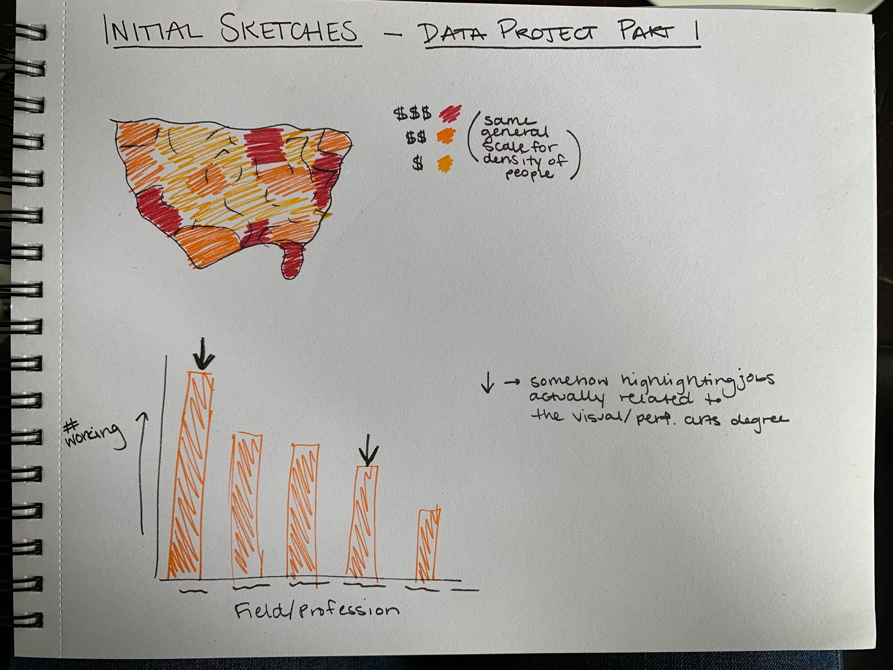

[Back to Main Page](/Emanuelson_Portfolio)

# FINAL PROJECT DELIVERABLE PAGE

## Data Project Part 1

### Outline

I was really intrigued by the data I used for my second visualization assignment about the professions of those who received visual or performing arts degree. This led me to decide to use datasets on the same sort of data for my final project. As an arts lover and someone who wants to go into the professional arts management field, it was important for me to understand where these artistic people are coming from and what they’re doing now. 
My final project will be a summary of what areas of the country have the highest paid visual and performing arts degree recipients, along with what areas of the country have the highest concentration of visual and performing arts degrees. Then, this will be juxtaposed by the distribution of visual and performing arts degrees recipients across different professional fields.
I am hoping to tell the story of where there visual and performing arts degree recipients are now, where they can be paid the most, and what professions they can expect they may go into. Sadly, the data points to that many of these degree recipients are not in the visual and performing arts fields. My call to action would be for employers to be continually understanding of the clear multiple talents visual and performing arts degree recipients have, while also understanding the pay they deserve.

#### User Stories
“As a current student completing a visual or performing arts degrees, I want to know what people with my degrees do, so that I can better prepare for my life post-college.”

“As a recipient of a visual or performing arts degree that is currently working, I want to know more about people like me and if what I’m experiencing is normal, so that I can better understand myself and my cohort.”

“As a potential employer of visual or performing arts degree recipients, I want to better understand these employees, so that I can more effectively hire and work with them.”

### Initial Sketches

### My Selected Data

I selected my data from Data USA when I found a page on their site dedicated to people who have received visual or performing arts degrees and where they are now. The page has a multitude of very specific data sets based on one subject of interest. For this reason, I selected three datasets to create more of a well-rounded project. I selected the 3 main datasets because they were the topics most interesting to me, but I may end up going back and finding another dataset from the same page if I find an interesting gap or missing point in my data analysis and story!

All my data sets will turn into different graphs to outline different aspects of my story. I want to use them all to present a comprehensive but coherent outline of people who received visual and performing arts degrees and their current status. While these are all different spreadsheets, they all follow the same subject, so I think it makes sense to treat them as one dataset, for the most part.

#### Link to Data USA Page
https://datausa.io/profile/cip/visual-performing-arts

#### Link to Data Samples

Github flagged my data as being too large to present, so I have provided some sample rows pulled from my full datasheet here for your viewing.
##### First Dataset
[Highest Paying Location Data](HighestPaying_Locations_Sample.xlsx)

##### Second Dataset
[Highest Concentration Location Data](SpecialtyLocation_Sample.xlsx)

##### Third Dataset
[Current Occupation Distribution Data](CurrentOccupations_Sample.xlsx)

### Method & Medium

I plan to use Shorthand as my final deliverable for this project. While it is not a platform I’ve utilized, I feel putting myself in a place to learn how to use even more platforms and resources is the best option for me. 

The structure of my story will center around showcasing the highest paying areas of the country for visual and performing arts degrees recipients, which will then be juxtaposed against the areas of the country with the highest concentrations of visual and performing arts degree recipients. Then, I will present data showing the field and professions that visual and performing arts recipients are in but will bolster this by also showing the salaries they receive. I want this story to show that struggles of people with these degrees, but also that they are still doing okay! 

## Data Project Part 2

### Initial Wireframe

### User Research

#### Target Audience
My target audience for my visualizations are people in the visual or performing arts field, recipients of visual or performing arts degrees, or current students working towards a visual or performing arts degree. I think these are the groups of people who would be most interested in location, pay, and current jobs of those who received a visual or performing arts degree. I want this information to be a snapshot of the status of visual or performing arts degree recipients in the US. The people who would be most concerned about that snapshot would logically be the people working in those fields, the people who have those degrees, or the people who are currently getting those degrees.

#### Approach to Identifying Interviewees
Luckily, being in an Arts Management program, there is no shortage of people in the visual or performing arts fields or people with visual or performing arts degrees. I plan to show my wireframes/storyboard to a few of my classmates around class time or in Hamburg during a break between classes. These people are within my target audience and are within easy reach for interviews, so they make the most sense for this project and scope.

#### Interview Script & Findings
[Transcription of Responses](Interviews.pdf) 

(transcribed using Otter.ai)

##### Most Impactful Findings
- It seemed that respondents had my audience about 75% right. They mainly thought it was people in the jobs outlined or people getting their degrees in this field, so I was happy with their interpretation of the audience. Their other guesses weren’t that far off of those audience bases. 
- Another comment I found interesting was to switch the first two maps. The respondent thought the concentration of subjects in certain areas should come first, followed by where these subjects get paid the most.
- Another concern was the highlighting in visual 3. The respondent wanted all non-degree-related jobs to be in gray, not in the light purple.
- One comment was to maybe look at their education or student debt, if possible. I will go back into the Data USA and see if there is a data set based in education, in any way.

### Revised Wireframe/Storyboard

#### Changes Made Based on User Research
- I changed the order of the first two visuals to make concentration of people first followed by areas with the highest salary. I actually think this is really the most logical way to introduce the data, so I appreciate the comment from my respondent pointing this out.
- I adjusted my shading of visual 3 to make the bars gray instead of light purple. This will end up highlighting the degree-related jobs without confusing the shading with concentration, as it is used in other visuals.
- I pulled data on what different institutions’ tuition costs, so I added a visualization based on that information due to what one respondent raised as a potentially interesting addition. 

### Persona

- [Persona of Student Audience](Persona_Anna.pdf)
- [Persona of Workforce Audience](Persona_Daniel.pdf)

### Moodboard

[Presentation and Visualizations Moodboard](Moodboard.pdf)

## Data Project Part 3 and 4 - The Final Deliverables

### Final Intended Audience

In the end, I determined two final personas of viewers of my data: a current student who is working towards obtaining a visual or performing arts degree & a visual or performing arts degree recipient who is wondering about others in his cohort. There personas are represented in the persona section above. I ended up minimizing my audience due to the very differing priorities of some of my initial personas. I realized that the interests of employers who may be hiring this cohort would probbaly not line up with the data those who are actually in the cohort would want to know.

For these reasons, I decided to minimize my audinece to only two segments of people. This allowed me to hone in on certain data and created a more pointed focus to my final deliverable and presentation.

### My Work So Far

### Digital Deliverable - Final Data Story

[Outline Preview](https://preview.shorthand.com/eD7LOH88KKM9Zpuo)

Linked above is the Shorthand presentation I've created for this project. It includes all my final visualizations, as well as some text to indicate some conclusions. 

