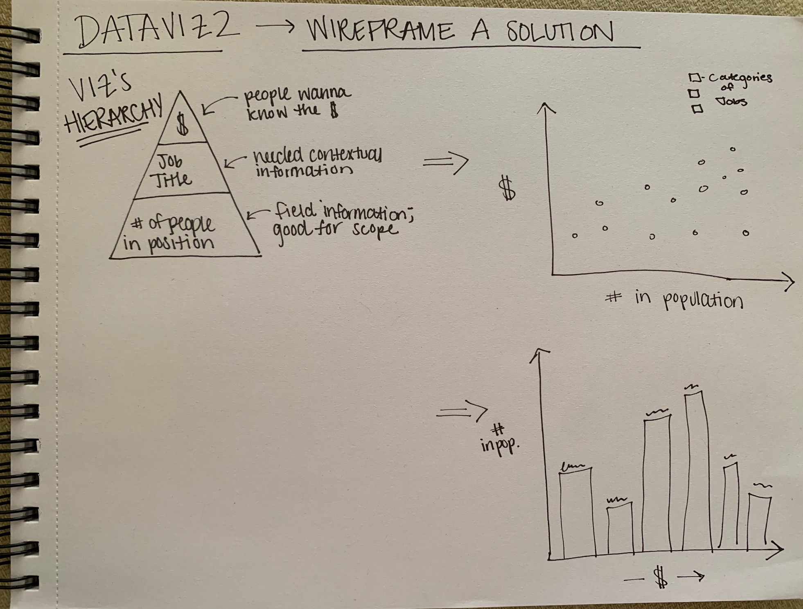

https://mariane96.github.io/Emanuelson_Portfolio/

# Critique and Re-Visualization Assignment

## Original Data Visualization

<iframe width="720px" height="480px" src="https://datausa.io/profile/cip/visual-performing-arts/employment/top_income?viz=true" frameborder="0" ></iframe>

## Thoughts

I selected this particular visualization because I always find it interesting how many people end up in positions which don't have much to do with their degree. I also am passionate about the arts, so I was particularly drawn to data based in recipients of visual or performing arts degrees and where they are now!

My main issue with the visualization was the over-simplification of the data. Only presenting a few job groups when there are many more present in the data seems off. I wasn't a huge fan of the bar chart format, but it would be okay if it was at least sorted highest to lowest. I was intersted in taking the data and experimenting with different format options such as a bubble chart, scatter plot, or more organizaed bar chart.

For my wireframes, I wanted to highlight the three main aspects of the data: number of people in the position, position title, and salary. I wireframed two possible solutions. One of a dot plot-type chart and another as a re-imagined bar chart. Upon receiving some feedback, I was told that the salary aspet seemed to be the most interesting or important piece of data, so that should be more prevalent. As a result, I shifted some of my design to better highlight the salary. I ended up making the main y-axis the salary, while leaving only the job title on the x-axis. This left room to indicate population via shading. 

## Final Re-Visualization

